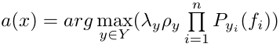

# SMPR
Системы и методы принятия решения 4 курс 1 семестр

## Содержание

- [Метрические классификаторы](#Метрические-классификаторы)
  - [Алгоритм K ближайших соседей](#Алгоритм-K-ближайших-соседей)
  - [Алгоритм K взвешенных ближайших соседей](#Алгоритм-K-взвешенных-ближайших-соседей)
  - [Метод Парзеновского окна](#Метод-Парзеновского-окна)
  - [Метод потенциальных функций](#Метод-потенциальных-функций)
- [Байесовские алгоритмы	классификации](#байесовскиеалгоритмыклассификации)
  - [Линии уровня нормального распределения](#линииуровнянормальногораспределения)
  # Метрические классификаторы
   ## Алгоритм K ближайших соседей
   
   KNN(Алгоритм K ближайших соседей) - относит объект к тому классу элементов, которого больше среди k ближайших соседедей.
   
   ### Описание алгоритма

   Все объекты выборки сортируются по расстоянию до объекта, который необходимо классифицировать.
   Код функции сортировки:
   ```r
   sortObjectsByDist <- function(xl, z, metricFunction = euclideanDistance)
   {
    l <- dim(xl)[1]
    n <- dim(xl)[2] - 1
    distances <- matrix(NA, l, 2)
    for (i in 1:l)
    {
      distances[i, ] <- c(i, metricFunction(xl[i, 1:n], z))
    }
    orderedXl <- xl[order(distances[, 2]), ]
    return (orderedXl);
   }
   ```
   В качестве расстояния используется функция:
   ```r
   euclideanDistance <- function(u, v)
   {
    sqrt(sum((u - v)^2))
   }
   ```
   После сортировки подситываем количество объектов каждого класса в первых k объектах отсортированной выборки.
   Относим объект к классу, элементов которого больше среди ближайших соседей. Таким образом код функции knn будет выглядеть следующим образом:

   ```r
   kNN <- function(xl, z, k)
   {
    # Сортируем выборку согласно классифицируемого объекта
    orderedXl <- sortObjectsByDist(xl, z)
    n <- dim(orderedXl)[2] - 1
    # Получаем классы первых k соседей
    classes <- orderedXl[1:k, n + 1]
    # Подсчитываем количество элементов каждого класса
    counts <- table(classes)
    # Находим класс, который доминирует среди первых k соседей
    class <- names(which.max(counts))
    return (class)
   }
   ```

   ### Выбор параметра k с помощью LOO
   Для нахождения оптимального k для алгоритма K ближайших соседей воспользуемся критерием скользящего контроля LOO (Leave One Out).
    
    #### Описание

    Критерий LOO заключается в том, что мы поочередно берем каждый из N элементов выборки и классифицируем его с помощью описанного выше алгоритма на оставшихся N-1 элементах выборки. После классификации проверяем совпал ли класс, который мы определили с его изначальным классом. Таким образом мы можем оценить количество ошибок алгоритма.

    Подсчитав количество ошибок для каждого k от 1 до N, выбираем k, при котором их количество минимально.

    #### Оптимизация
   
    Описанный выше алгоритм использует функцию knn для каждой из точек для каждого k. Таким образом для каждой точки мы сортируем выборку k раз.

    Для того, чтобы не сортировать выборку для одной и той же точки при разном k, оптимизируем алгоритм.
   
    Вместо того, чтобы запускать его для каждого k отдельно. 
    Передадим в функцию вектор из N нулей для записи ошибок.
    Тогда для каждой классифицируемой точки нам необходимо:
    * Отсортировать выборку по расстоянию до этой точки.
    * Для каждого k классифицировать эту точку по отсортированной выборке.

    Чтобы найти оптимальное k нужно взять элемент вектора с минимальным числом ошибок.

    #### Код

    ```r
    looknn <- function(len, data) 
    # len - количество элементов выборки
    # data - выборка
    {
      # Создаем вектор и заполняем его 0
      result = c(rep(0, length( seq(1, len, 1) ) ) )
      # Перебираем элементы выборки
      for(i in c(1:length(data[,1]) ) )
      {
        xl <- data[-i,]
        z <- data[i,1:2]
        # Сортируем выборку
        orderedXl <- sortObjectsByDist(xl, z)
        n <- dim(orderedXl)[2] - 1 
        # Перебираем k от 1 до len
        for (k in seq(1, len, 1))
        {
          # Классифицируем элемент выборки
          classes <- orderedXl[1:k, n+1]
          count <- table(classes)
          class <- names(which.max(count))
          if(class != data[i,3])
          {
            result[k] = result[k] + 1
          }
        }   
      }  
      return(result)
    } 
    ```
 
    #### Результат

    Количество ошибок для каждого k можно увидеть на графике.
 
    
 
    Таким образом оптимальное k для данного алгоритма равно 6.
 
   ### Карта классификации с помощью алгоритма **KNN**
 
   Построим карту классификации для оптимального k = 6.
   Для этого запустим алгоритм KNN для каждой точки плоскости.
 
   
   
   ## Алгоритм K взвешенных ближайших соседей
   
   ### Описание алгоритма
   Данный алгоритм является модификацией алгоритма K ближайшх соседей. Отличием является то, что при классификации учитывается не только, количество элементов определенного класса, но и расстояние от этих элементов до классифицирумого объекта.
   
   Таким образом, для каждого i-ого соседа вычисляется значение его веса w(i), убывающее с ростом значения i. В данном случае: w(i) = q^i, где q - параметр, принимающий значения от 0 до 1.

   ```r
   #Функция расчета веса w(i)
   weightsKWNN = function(i, q)
   {
      q^i
   }
   ```
   
   ```r
   kwnn <- function(xl, z, k, orderedXl)
   {
    
    n <- dim(orderedXl)[2] - 1
    weights = rep(0,3)
    names(weights) <- c("setosa", "versicolor", "virginica")
    # Сортируем выборку
    classes <- orderedXl[1:k, n+1]
    for(i in 1:k)
    {
      weights[classes[i]] <- weightsKWNN(i,k) + weights[classes[i]];
    }
    class <- names(which.max(weights))
    return (class)
   }

   ```
   ### Выбор параметров k и q с помощью LOO
   Чтобы найти оптимальные значения k и q для алгоритма K взвешенных ближайших соседей воспользуемся критерием скользящего контроля LOO (Leave One Out).

    #### Описание
    С помощью Критерия LOO, описанного [выше](####-Выбор-параметра-k-с-помощью-LOO)
    подсчитаем количество ошибок алгоритма для q от 0 до 1 и для k от 1 до N (N - количество элементов выборки).

    С помощью следующей функции подберем значения k и q, количество ошибок для которых будет минимально.

    ```r
    LOO = function(xl,class) 
    {
      n = dim(xl)[1]
      mininloo = n
      qopt = 0
      kopt = 0
      for(q in seq(0.1, 1, by=0.1))
      {
        loo = rep(0, n-1)
        for(i in 1:(n))
        {
          X=xl[-i, 1:3]
          u=xl[i, 1:2]
          orderedXl <- sortObjectByDist(X, u)
            for(k in 1:(n-1))
            {
              test=kwnn(X,u,k,q,orderedXl)
              if(colors[test] != colors[class[i]])
              {
                loo[k] = loo[k]+1;
              }    
            }
        }
        if(min(loo)<mininloo)
        {
          mininloo = min(loo)
          qopt = q
          kopt = which.min(loo)
        }
      }    
      print(kopt)
      print(qopt)   
     }   
    ```
    Оптимальными значениями являются k = 7, q = 0.6
    Так как невозможно отобразить зависимость количества ошибок от q и k, то покажем на графиках зависимость ошибок от k при оптимальном q и от q при оптимальном k.
    
    График LOO при оптимальном q | График LOO при оптимальном k
    :---------------------------:|:----------------------------:
    |

   ### Демонстрация преимущества kwnn над knn

   На рисунке ниже показаны точки, в которых есть различия в классификации с помощью knn и kwnn. В таких точках внешний цвет круга обозначает результат классификации с помощью kwnn, а внутренний - knn.
   В точках, которые не закрашены внутри классификация kwnn и knn совпадает.

   

   Разница в классификации возникает, из-за того, что для kwnn наиболее важными являются ближайшие объекты, а для knn равноценны все k ближайших объектов.
   Таким образом, если (k / 2 - 1) ближайших объекта принадлежат одному классу, а остальные (k / 2 + 1) принадлежат другому классу, но их суммарный вес меньше, чем вес объектов первого класса, то kwnn - классифицирует объект к первому классу, а knn - классифицирует объект ко второму, так как элементов этого класса больше среди ближайших k элементов выборки.

   ## Метод Парзеновского окна

   ### Описание алгоритма
   PW(Метод Парзеновского окна) - относит объект к тому классу элементов, вес которого больше для данной точки. Вес каждого класса для данной точки определяется функцией ядра, зависящей от расстояния до классифицируемой точки и параметра h - ширины окна.

   Рассмотрим 5 основных типов ядер:
   * Треугольное
    ```r
      kernelT = function(r)
      {  
        return ((1 - abs(r)) * (abs(r) <= 1)) 
      }
    ```
   * Прямоугольное
    ```r
      kernelR = function(r)
      {
        return ((0.5 * (abs(r) <= 1) )) 
      }
    ```
   * Квартическое
    ```r
      kernelQ = function(r)
      {
        return ((15 / 16) * (1 - r ^ 2) ^ 2 * (abs(r) <= 1)) 
      }
    ```
   * Епанечниково 
    ```r
      kernelEP = function(r)
      { 
        return ((3/4*(1-r^2)*(abs(r)<=1))) 
      } 
    ```
   * Гауссовское
    ```r
      kernelG = function(r)
      {
        return (((2*pi)^(-1/2)) * exp(-1/2*r^2)) 
      }
    ```
   ### Реализация алгоритма
   Ниже приведен код функции Парзеновского окна на языке R
   ```r
   pw = function(xl,y,h,metricFunction = euclideanDistance) 
  { 
    n = dim(xl)[1] 
    weights = rep(0,3) 
    names(weights) = c("setosa", "versicolor", "virginica") 
    for(i in 1:n) 
    { 
      x=XL[i,1:2] 
      class=XL[i,3] 
      # Использование параметра h
      r = metricFunction(x,y)/h 
      # Квартическое ядро
      weights[class]=kernelQ(r)+weights[class]; 
      # Треугольное ядро
      #weights[class]=kernelT(r)+weights[class];
      # Прямоугольное ядро
      #weights[class]=kernelR(r)+weights[class];
      # Епанечниково ядро
      #weights[class]=kernelEP(r)+weights[class];
      # Гауссовское ядро
      #weights[class]=kernelG(r)+weights[class];
    } 
    class = names(which.max(weights)) 
    if(max(weights)==0)
    { 
      return ("NA") 
    } 
    else 
    { 
      return (class) 
    } 
  } 
   ``` 
   ### Выбор параметра h с помощью LOO
   Чтобы найти оптимальные значение ширины окна h для Парзеновского окна воспользуемся критерием скользящего контроля LOO (Leave One Out).

    #### Описание
    С помощью Критерия LOO, описанного [выше](####-Выбор-параметра-k-с-помощью-LOO)
    подсчитаем количество ошибок алгоритма для h от 0.1 до 2 при использовнии различных ядер.
    
    ### Результат

    Ядро | График LOO | Карта классификации
    :---:|:----------:|:--------------------:
    Треугольное||
    Прямоугольное||
    Квартическое||
    Епанечниково||
    Гауссовское||

   ## Метод потенциальных функций

   ### Описание

   Метод потенциальных функций похож на [метод Парзеновского окна](##-Метод-Парзеновского-окна), но помимо функции ядра и ширины окна - h, использует также "потенциал" для оценки важности каждого из элементов выборки.
   При реализации алгоритма зададим фиксированное h (1 - для объектов класса setosa, так как объекты этого класса значительно удалены от объектов других классов, и 0.5 - для объектов других классов). 

   Для определения важности ("потенциала") каждого из элементов обучающей выборки воспользуемся следующим алгоритмом:

   - Положим все потенциалы равными 0
   - Посчитаем количество ошибок при классификации объектов выборки
   - Находим точку, которая классифицируется не верно и увеличиваем потенциал на 1
   - Повторяем предыдущие два шага до тех пор, пока количество ошибок не станет меньше допустимого значения (в нашем случае - 5)
   
   ```r
   #Алгоритм вычисления потенциалов
   potentialsMethod <- function(data, p, core, g, h) 
  {
    len <- dim(data)[1]
    classCount <- dim(table(data$Species))
    
    classes <- rep(0, classCount)
    names(classes) <- levels(data$Species)
    
    for (i in seq(len)) {
      e <- data[i,]
      distance <- dist(p, e[1:2])
      
      weight <- g[i] * core(distance / h[i])
      classes[e$Species] <- classes[e$Species] + weight
    }
    
    if (max(classes) == 0) {
      return ("")
    }
    return (names(which.max(classes)))
  }

  #Подсчет количества ошибок при классификации выборки
  countErrors <- function(data, core, g, h) {
    len <- dim(data)[1]
    err <- 0
    
    for (i in seq(len)) {
      e <- data[i,]
      res <- potentialsMethod(data, e[1:2], core, g, h)
      
      if (res != e$Species)
      {
        err <- err + 1
      }
    }
    
    return(err)
  }

  #Нахождение потенциалов элементов выборки
  findPotentials <- function(data, core, h, maxErr = 5) {
    len <- dim(data)[1]
    #Заполняем потенциалы 0
    g <- rep(0, len)
    i <- 1
    while(countErrors(data, core, g, h) > maxErr) {
      e <- data[i,]
      #Классифицируем элементы выборки
      res <- potentialsMethod(data, e[1:2], core, g, h)
      #Если элемент выборки классифицировался не верно увеличиваем потенциал
      if (res != e$Species)
      {
        g[i] <- g[i] + 1
      }
      i <- sample(seq(len), 1)
    }
    return(g)
  }
   ```
   
   ### Результат
   После нахождения всех потенциалов сделаем рисунок, на котором покажем "потенциалы" объектов выборки и построим карту классификации для разных ядер с максимальным допустимым количеством ошибок равным 5.

   Потенциал каждой из точек на рисунке показан с помощью круга радиуса h и прозрачностью равной g/max * 0.2, где g - потенциал в данной точке, а max - самый большой потенциал среди точек выборки.

   Ядро | Потенцалы | Карта классификации
   :---:|:----------:|:--------------------:
   Гауссовское||
   Треугольное||


# Байесовские	алгоритмы	классификации
   ## Линии	уровня	нормального	распределения

   Плотность n-мерного нормального распределения равна:
   
   где mu - математическое ожидание, а sigma - ковариационная  матрица (должна быть симметричной, невырожденной и положительно определенной).

   Покажем на графике линии уровня нормального распределения и рассчитаем плотность. 
   Для этого рассчитаем коэффициенты уравнения кривой второго порядка:

   

   Для этого перемножим векторы и обратную матрицу.
   Положим обратную матрицу равной

   
   
   Тогда после вычислений получим следующие значения:
   ```r
   A <- a
   B <- d
   C <- b+c
   D <- -2*a*x0 - c*y0 - b*y0
   E <- -2*d*y0 - c*x0 - b*x0
   F <- a*x0*x0 + d*y0*y0 + b*x0*y0 + c*x0*y0
   ```

   Воспользуемся полученными формулами для нахождения плотности и построим график.

   Одинаковая дисперсия | Различная дисперсия | Коррелированные признаки
   :-----:|:-----:|:-----:
   ||

   Реализация на R:

   ```r
   drawLines <- function(center, cv) 
   {
    #Находим определитель
    det <- det(cv)

    #Находим обратную матрицу
    cv <- solve(cv)
    
    a <- cv[1, 1]
    b <- cv[1, 2]
    c <- cv[2, 1]
    d <- cv[2, 2]
    
    x0 <- center[1]
    y0 <- center[2]

    #Вычисляем коеффициенты уравнения 2-ого порядка
    A <- a
    B <- d
    C <- b+c
    D <- -2*a*x0 - c*y0 - b*y0
    E <- -2*d*y0 - c*x0 - b*x0
    F <- a*x0*x0 + d*y0*y0 + b*x0*y0 + c*x0*y0
    
    #Вычисляем плотность
    func <- function(x, y) 
    {
      1 / (2*pi*sqrt(det)) * exp(-0.5 * (x^2*A + y^2*B + x*y*C + x*D + y*E + F))
    }
    
    X <- seq(-8, 8, len=100)
    Y <- seq(-8, 8, len=100)
    Z <- outer(X, Y, func)
    
    contour(X, Y, Z)
   }
   ```

   [Здесь](https://korolev.shinyapps.io/lines/) можно ознакомиться с реализацией на shiny.

   ## Наивный байессовский классификатор
   ### Описание алгоритма
   Наивный байессовский классификатор основан на предположении,что все признаки классов объектов выборки независят друг от друга.

   Таким образом, наивный имеет следущий вид:
   

   Прологарифмируем данную формулу. Получим следующее выражение:
   

   Для реализации создадим выборку с помощью функции многомерного нормального распределения MVRNORM библиотеки MASS.

   ```r
   mvrnorm(n, mu, Sigma)
   #n - количество признаков
   #mu - мат. ожидание
   #Sigma - положительно-определенная ковариационная матрица
   ```

   По полученной выборки восстановим плотности распределения каждого класса. Для этого воспользуемся следующей формулой:
   

   Реализация на R:
   ```r
   #Функция расчета плотности распределения класса
   getP <- function(x, M, D)
   {
    return( (1/(D*sqrt(2*pi))) * exp(-1 * ((x - M)^2)/(2*D^2)) )
   }
   naive <- function(x, M, D, Prob, Prior)
   #M - мат. ожидание признака
   #D - дисперсия признака для данного класса 
   {
    res <- log(Prob * Prior)
    l <- length(x)
    
    for (i in seq(l)) {
      p <- getP(x[i], M[i], D[i])
      res <- res + log(p)
    }
    
    return(res)
  }
   ```
  
  ### Пример
  


  


  


   


   
